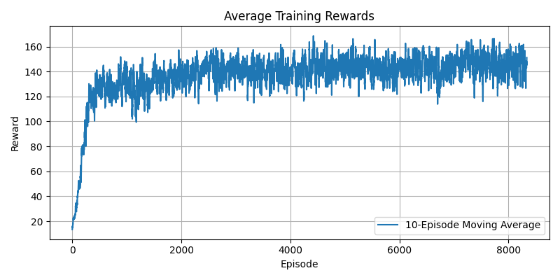
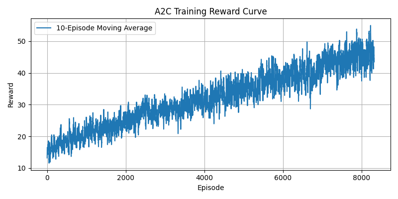
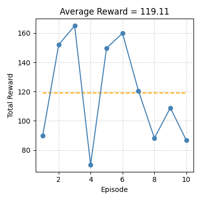
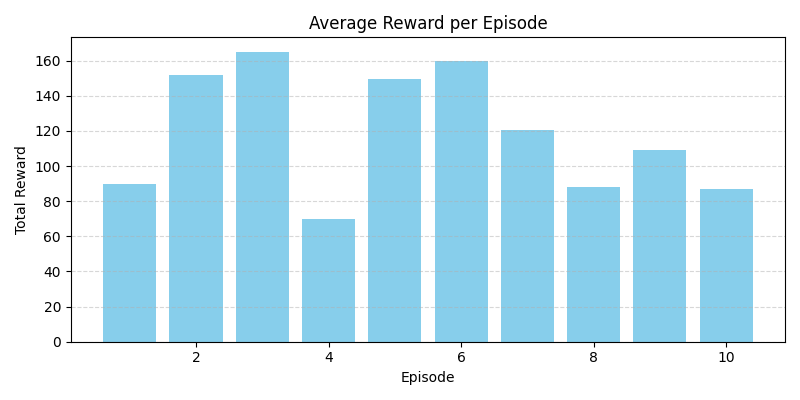
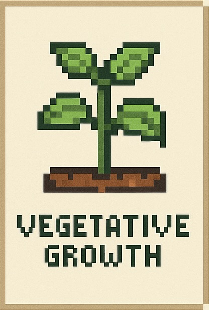

# 🌾 Reinforcement Learning-Based Smart Crop Irrigation System

This repository presents an academic project focused on designing and evaluating a smart irrigation system using reinforcement learning. The goal is to develop agents capable of learning optimal water distribution strategies across a growing season while adapting to soil moisture, crop needs, and environmental dynamics. 

---

## 🎯 Objective

The central objective of this project is to reduce water wastage and maximize crop health using intelligent irrigation scheduling. Overirrigation can degrade soil and lower yields, while underwatering causes plant stress. Our RL agents are trained to balance moisture levels to maintain crop health and achieve optimal growth without excess water use.

---

## 🌱 Environment Overview

We created a custom OpenAI Gym-compatible environment that simulates a complete crop growing season (120 days). The crop lifecycle is divided into 3 stages:

1. **Seedling**
2. **Vegetative**
3. **Mature**

At each timestep (day), the agent chooses one of 11 irrigation levels. The state includes:

- **Soil Moisture**: Normalized between 0 and 1
- **Crop Water Loss Rate**
- **Crop Coefficient**: Represents water demand
- **Leaf Area Index (LAI)**: Crop density
- **Growth Stage**: Progress in the 120-day cycle
- **Previous Irrigation Level**
- **Day Number**

---

## 🧠 Reward Mechanism

Rewards are based on multiple real-world agricultural factors:

- ✅ **Positive Rewards**:
  - Soil moisture within [0.6, 0.9]
  - Healthy crop growth
  - Minimal water waste

- ❌ **Negative Penalties**:
  - Moisture < 0.6 or > 0.9
  - Excessive irrigation
  - Stressed crops due to under/overwatering
  - Extreme temperature penalties (outside 5°C–35°C)

Crops are marked "stressed" if optimal conditions are not maintained for >70% of any growth stage.

---

## 🧪 Algorithms Implemented

### 🔹 DQN (Deep Q-Network)
- Learns Q-values through experience replay
- Epsilon-greedy exploration
- Neural network approximates value function

### 🔹 A2C (Advantage Actor-Critic)
- Parallel actor-learners
- Generalized Advantage Estimation (GAE)
- Entropy-based exploration encouragement

### 🔹 PPO (Proximal Policy Optimization)
- Policy gradient method with clipped loss
- Optimizes reward while avoiding drastic policy shifts
- Fast convergence and stable learning

---

## 📊 Training & Evaluation

### PPO Agent
- Timesteps: 1,000,000  
- 

### DQN Agent
- 
- 
- 
- 

### A2C Agent
- 
- 
- 

---

## 🌾 Crop Growth Visualization

| Stage      | Image                        |
|------------|------------------------------|
| Seedling   |       |
| Vegetative |     |
| Stressed   |       |
| Mature     |         |

---

## 🎥 Simulation Demos

- [Healthy Crop Growth](media/Crop_with_perfect_growth.mp4)
- [Stressed Crop Scenario](media/Crop_with_stressed_stage.mp4)

---

## 📁 Folder Structure

```
RL-Crop-Irrigation/
├── models/            # Trained agent checkpoints
├── media/             # Reward plots, crop stage visuals, videos
├── logs/              # Training metrics (monitor.csv)
├── notebook/          # Training pipeline and evaluation code
├── docs/              # Final academic report (PDF)
├── requirements.txt   # Environment dependencies
├── .gitignore
└── README.md
```

---

## 📦 Setup Instructions

```bash
git clone https://github.com/your-username/RL-Crop-Irrigation.git
cd RL-Crop-Irrigation

# (Optional) Create virtual environment
python -m venv venv
source venv/bin/activate  # On Windows: venv\Scripts\activate

# Install dependencies
pip install -r requirements.txt
```

---

## 📘 References

- APSIM Weather Simulation: https://www.apsim.info  
- Crop-Gym Environment: https://github.com/WUR-AI/crop-gym  
- Stable-Baselines3: https://github.com/DLR-RM/stable-baselines3  
- PPO Algorithm: https://arxiv.org/pdf/1707.06347.pdf

---

## 👨‍🏫 Academic Context

This project was developed as part of an advanced AI coursework assignment at the University at Buffalo. It demonstrates real-world application of reinforcement learning to sustainable agriculture. The simulation approximates real environmental challenges and promotes research in data-driven farming strategies.

**Report**: [`docs/mkakarla_pdoma_uditbrah_final_project.pdf`](docs/mkakarla_pdoma_uditbrah_final_project.pdf)

---

## 👨‍💻 Contributors

- **Aravind Aripaka** – Reinforcement Learning implementation, evaluation, and reporting  
- **Team** – Simulation modeling, training integration, and analysis

---

## 📄 License

This project is released for academic and research use only.
